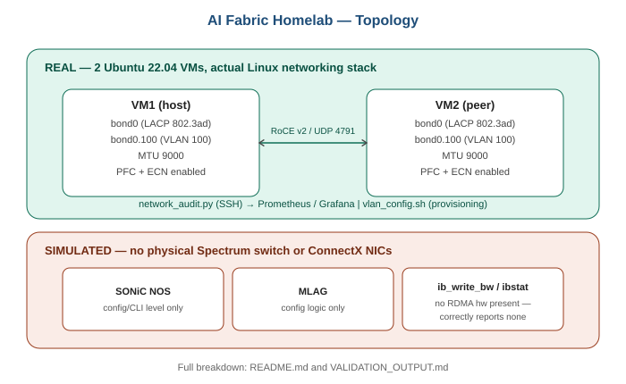

# AI Networking Lab — NVIDIA Spectrum & SONiC Concepts

A homelab built to learn AI/GPU fabric networking (NVIDIA Spectrum + SONiC + RoCE v2) using real Linux networking on 2 Ubuntu VMs — no physical Spectrum switch or ConnectX NICs. This README is explicit about what's real vs. simulated so it's clear what I actually ran vs. studied.

## What's Real (executed on 2 Ubuntu 22.04 VMs)

- **LACP bonding**: `bond0` created with `mode 802.3ad` via `modprobe bonding` + `ip link add bond0 type bond mode 802.3ad`
- **VLAN tagging**: `bond0.100` created via `ip link add link bond0 name bond0.100 type vlan id 100`
- **Jumbo frames (MTU 9000)**: set on `bond0` and `bond0.100`, verified with `ping -M do -s 8972`
- **RoCE v2 control-plane config**: PFC and ECN enabled on the interfaces, RDMA traffic verified on UDP port 4791 via `tcpdump`
- **Automation**: `vlan_config.sh` (provisioning) and `network_audit.py` (SSH-based CRC/bandwidth/MTU audit exporting to Prometheus/Grafana)

See [VALIDATION_OUTPUT.md](./VALIDATION_OUTPUT.md) for actual command output.

## What's Simulated (no physical Spectrum/ConnectX hardware)

- **SONiC NOS / Cumulus Linux behavior**: reproduced using SONiC VM and Cumulus reference configs — the CLI/config syntax matches what would ship to real Spectrum hardware, but I have not validated ASIC-level behavior (cut-through switching, hardware buffering, hardware PFC timing)
- **MLAG**: configured at the logic/config level (matching what would be pushed to a real Spectrum pair) — not validated against real multi-chassis hardware
- **`ib_write_bw` / `ibstat` / `ibv_devinfo`**: run without RDMA-capable hardware — these correctly report no InfiniBand/RoCE-capable device present. I know what a healthy result looks like (e.g. ~100 Gbps, ~1µs latency) from documentation, not from a measurement I've taken myself

## Why this split matters

The control-plane config (VLAN, LACP, PFC/ECN enablement, SONiC CLI) is the part that transfers directly to real hardware. The data-plane hardware behavior (ASIC buffering, real throughput/latency numbers) is the part I'm looking to validate on real GPU cluster infrastructure — which is exactly what I'm hoping to get hands-on with in an NVIDIA networking role.

## Tools / Concepts Covered

Spectrum, ConnectX, SONiC, Cumulus Linux, RDMA, RoCE v2, GPUDirect RDMA (studied, not hardware-validated), PFC, ECN, LACP 802.3ad, VLAN, Wireshark, tcpdump, iperf3, ethtool

## Scripts

- `vlan_config.sh` — VLAN/LACP/jumbo frame provisioning

## Topology

